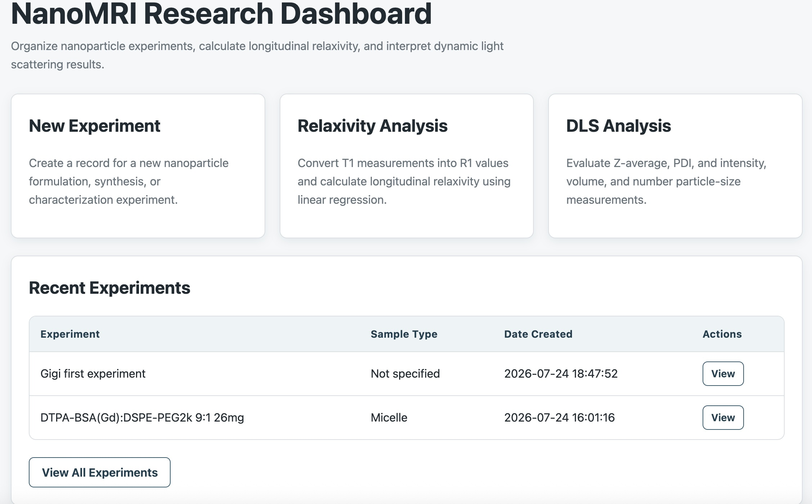
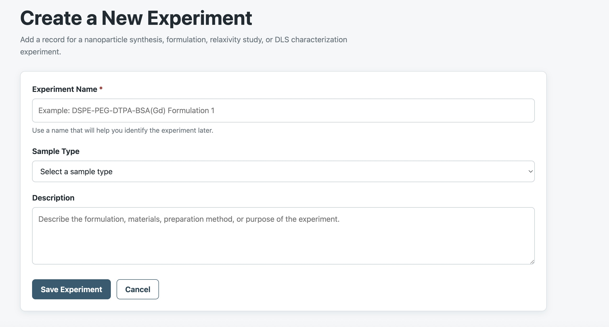
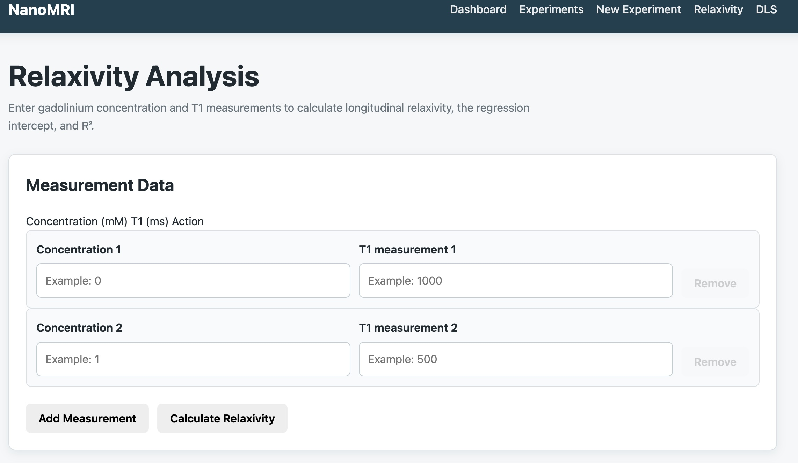
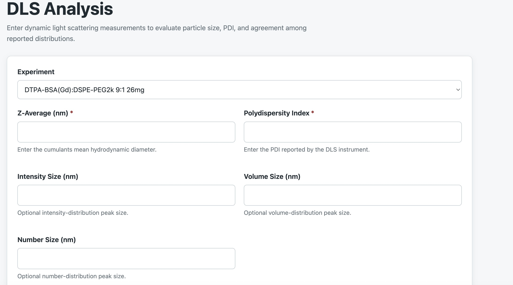

# Nano MRI Lab Suite
#### A Flask based web application for organizing and calculating nanoparticle analysis data.
#### The application combines relaxivity analysis, dynamic light scattering interpretation and data organization to act as an almost personalized lab notebook for mri contrast agent research
#### Video Demo
🚀 **[Launch MRI Nanoparticle Research Suite](https://youtu.be/z-o3pjLUuyU)**
## Features

## Relaxivity Analysis
#### Relaxivity is the metric used to determine how bright of a signal a contrast agent generates i.e. how effective the contrast agent is. It is calculated using concentration and time (T1) values to create R1 values which are plotted and the slope of the line is the relaxivity.
#### - Accepts multiple concentration and T1 measurements
#### - Converts T1 into R1
#### - Performs linear regression to calculate relaxivity
#### - Reports R^2 and intercept along with relaxivity

## DLS Analysis
#### DLS stands for dynamic light scattering and it measures the size of particles at three different sensitivities: intensity, number, and volume. The machine also automatically outputs a cumulative average of the three called a Z average.
#### - Evaluates polydispersity index
#### - Accepts four possible inputs four the size of the particles
#### - Outputs a report on the quality and size of the sample and makes recommendations for reporting data

## Experiment Tracking
#### - Records experiment details
#### - Organizes all samples in one place providing a centralized location for work
#### - Has extra space for any observations and organizes in a consistent format

## Images
## Dashboard

## Experiments

## New Experiments

## Relaxivity

## DLS

## Running the Project Locally
#### 1. Clone the repository
#### git clone PASTE-YOUR-REPOSITORY-URL-HERE
#### cd mri-nanoparticle-research-suite
#### 2. Create a virtual environment
#### On macOS or Linux:
#### python3 -m venv .venv
#### source .venv/bin/activate
#### On Windows:
#### python -m venv .venv
#### .venv\Scripts\activate
#### 3. Install the dependencies
#### pip install -r requirements.txt
#### 4. Start the application
#### python app.py
#### 5. Open the local website
#### Open the address shown in the terminal, usually:
#### http://127.0.0.1:5000

## Why I Made This Project
#### During my research making gadolinium based contrast agents for the lymphatic system, I spent a lot of time measuring the size and relaxivity of particles. This required three different machines and multiple excel and word files and it felt very disorganized and hard to keep track of. I decided this project would be a good way to expand my scientific computing skills while also helping me streamline and organize my data. My projects means I no longer need to plot a graph to calculate relaxivity or calculate averages to get size, giving me more time to focus on making samples.

## Author

#### Gabriella Gordon

#### Materials Science student interested in research and development, biomedical materials, nanoparticle characterization, and scientific software.
#### GitHub: ggordon4810
#### LinkedIn: [Gabriella Gordon](https://www.linkedin.com/in/gabriella-gordon-1a7b2536a/)

